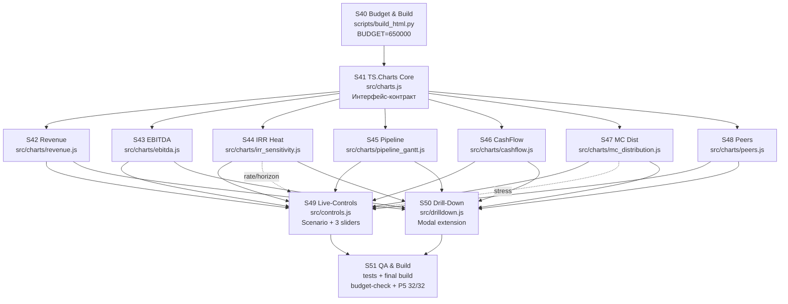

# 20_SUBAGENT_GRAPH.md — Граф субагентов Phase 2B

## Визуальный граф зависимостей



## Фазы запуска

### Фаза 1 (sequential, ~3 часа)

| Шаг | Субагент | Что делает | Выход | Блокирует |
|-----|----------|------------|-------|-----------|
| 1 | **S40** | Поднимает BUDGET в build_html.py до 650000, обновляет комментарии | commit `S40: raise bundle budget to 650KB` | S41 |
| 2 | **S41** | Реализует TS.Charts core: canvas/svg helpers, tooltip, axis, legend, palette. Публикует контракт. | commit `S41: add TS.Charts core` | S42-S48 |

### Фаза 2 (parallel 7-wide, ~2 дня)

Запускаются одновременно после коммита S41. Каждый чарт-субагент работает независимо в своём модуле.

| Субагент | Файл | Зависит от data | Ключи i18n |
|----------|------|-----------------|------------|
| S42 Revenue | src/charts/revenue.js | pipeline.revenue_by_year | ui.chart.revenue.* |
| S43 EBITDA | src/charts/ebitda.js | pnl.ebitda_breakdown | ui.chart.ebitda.* |
| S44 IRR Heat | src/charts/irr_sensitivity.js | sensitivity.irr_matrix | ui.chart.irr.* |
| S45 Pipeline | src/charts/pipeline_gantt.js | pipeline.projects[] | ui.chart.pipeline.*, ui.project.p1-p7.* |
| S46 CashFlow | src/charts/cashflow.js | cashflow.yearly | ui.chart.cashflow.* |
| S47 MC Dist | src/charts/mc_distribution.js | mc.irr_distribution | ui.chart.mc.* |
| S48 Peers | src/charts/peers.js | peers.comparables | ui.chart.peers.*, ui.peers.<code>.* |

Каждый коммит вида: `S4X: implement Chart-N <название>`.

**⚠️ Важно:** S44 (IRR sensitivity) и S47 (MC distribution) должны поддерживать live-пересчёт от sliders — эти два чарта имеют особенный контракт с S49.

### Фаза 3 (parallel 2-wide, ~1 день)

Запускается после того, как все 7 чартов в main ветке.

| Субагент | Файл | Использует |
|----------|------|------------|
| **S49 Live-Controls** | src/controls.js | TS.Charts.*, TS.emit, orchestrator URL-state |
| **S50 Drill-Down** | src/drilldown.js | TS.Components.Modal (Phase 2A), все 7 чартов |

S49 и S50 условно независимы, но S50 использует события click на чартах, которые S49 тоже слушает. Координация через `TS.emit('drilldown:open', ...)` — S50 подписан.

Коммиты: `S49: live-controls`, `S50: drill-down modal`.

### Фаза 4 (sequential, ~0.5 дня)

| Субагент | Что делает |
|----------|------------|
| **S51 QA & Build** | 1. Прогон всех 70+ тестов<br/>2. e2e-сценарии (scenario switch, sliders, drilldown)<br/>3. Финальная сборка build_html.py<br/>4. Budget-check: size ≤ 650 000<br/>5. Regex-check: нет eval / new Function / localStorage<br/>6. I18N symmetry-check: len(ru.json) == len(en.json)<br/>7. Генерация `P5_Phase2B_Verification_Report_v1.0.docx`<br/>8. git tag `v1.2.0-phase2b`<br/>9. Push в origin |

Финальный коммит: `S51: phase2b final bundle + QA + P5 report`.

## Матрица контрактов

| Производитель | Контракт | Потребитель |
|---------------|----------|-------------|
| S41 | `TS.Charts.createCanvas/createSVG/axisX/axisY/tooltip/legend/palette/formatValue` | S42-S48 |
| S42-S48 | `TS.Charts.register(chartId, renderFn)` | S49 (пересчитывает при scenario/param changed) |
| S49 | `TS.emit('scenario:changed')`, `TS.emit('param:changed')` | S42-S48 (подписываются через TS.on) |
| S50 | `TS.on('drilldown:open')` → открывает TS.Components.Modal | S42-S48 (emit при click) |
| S51 | budget-check, regression, P5 32/32 | (финал) |

## Критический путь

```
S40 (0.5h) → S41 (2.5h) → S42-S48 [parallel max 12h] → S49+S50 [parallel 8h] → S51 (4h)
────────── День 1 ──────────  ─── Дни 2-3 ───     ── День 4 ──     Day 4.5
```

**Общая длительность при правильном параллелизме:** 27 часов работы CC / 4.5 календарных дня.

## Правила для каждого субагента

1. **Один субагент → один коммит** (не больше). Если работа не помещается, декомпозируйте заранее и сообщите оператору.
2. **Именованный коммит** с префиксом `S<code>: <краткое описание>`.
3. **Не трогать чужие модули**. Если обнаружили баг в чужом модуле — создать `DEFER_<S>.md` с описанием, передать оператору.
4. **Тесты обязательны** для каждого чарт-субагента (5 тестов минимум).
5. **Проверить budget** перед коммитом: `python -c "import os; print(os.path.getsize('Deck_v1.2.0/TrendStudio_LP_Deck_v1.2.0_Interactive.html'))"` — должно быть ≤ 650 000.
6. **I18N симметрия**: любой новый ключ в ru.json одновременно в en.json (значение может быть `[EN:key]` stub — S51 флагнёт).

## Rollback plan

Если Phase 2B срывается (>24 апреля):
- **Cut S48 (Peers)** — удалить Chart-7, оставить 6 чартов
- **Cut S49 sliders** — оставить только scenario switcher без sliders
- **Cut S50** — отложить drilldown в Phase 2C

Каждый cut = отдельный revert-коммит, документированный в commit-msg.
