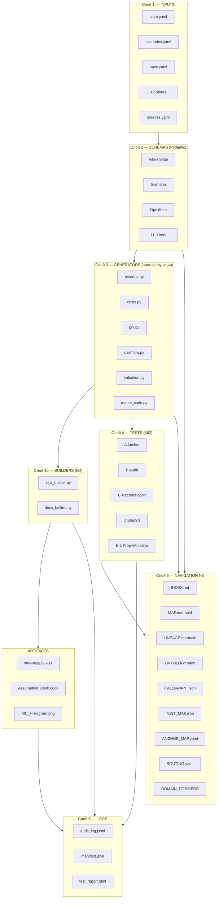
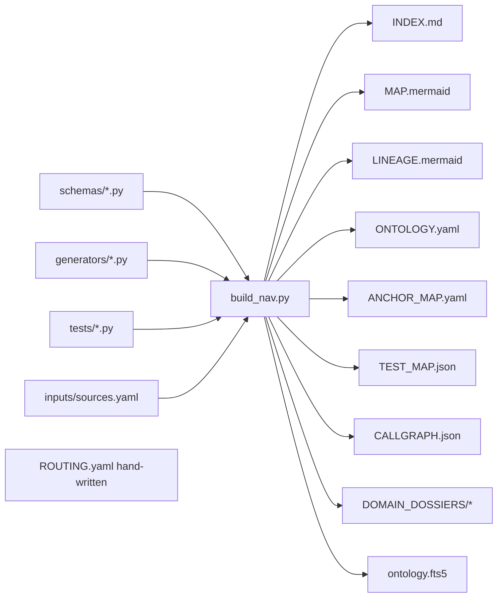
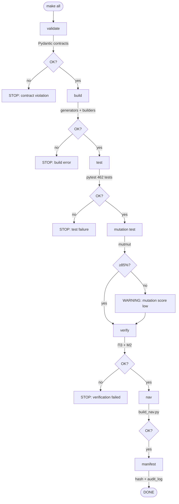

# ARCHITECTURE — Pipeline финмодели холдинга «ТрендСтудио»

**Версия:** 1.0
**Дата:** 11 апреля 2026
**Уровень надёжности:** L4 (462 автотестов + contracts + mutation testing)
**Уровень навигации:** N3 (авто-генерируемые карты + CALLGRAPH)
**Связанный документ:** `ПРОМТ_Финмодель_Холдинг_Кино_v2_FINAL.md`, раздел 19

---

## 0. TL;DR

Финмодель холдинга «ТрендСтудио» строится не как одноразовый xlsx-файл, а как **детерминированный pipeline**. Вместо того чтобы Claude «писал формулы прямо в Excel», мы разделяем ответственность на 6 слоёв: YAML-входы → Pydantic-контракты → чистые генераторы → 462 автотестов → авто-генерируемые навигационные карты → логи с хешами. Такой подход исключает случайные ошибки, обеспечивает полную воспроизводимость и делает модель пригодной для повторных пересборок без ручного переписывания.

**Главный инвариант системы:** `cumulative_ebitda_2026_2028 ∈ [2 970; 3 030] млн ₽` для базового сценария. Любое изменение, нарушающее этот инвариант, должно падать ещё на этапе валидации входов — до того как построен хотя бы один xlsx-файл.

---

## 1. ЦЕЛИ АРХИТЕКТУРЫ

1. **Детерминизм.** Два запуска `make all` с одинаковыми входами дают идентичные SHA256-хеши выходов.
2. **Контрактность.** Нарушение любого бизнес-инварианта (якорь, диапазоны, логика) падает на этапе валидации, а не проявляется в финальном xlsx.
3. **Провенанс.** Каждая значимая цифра в выходном xlsx имеет ссылку на `source_id` в `inputs/sources.yaml`, а оттуда — на исходный документ и страницу/ячейку.
4. **Верифицируемость.** 462 автотестов + 32 механизма верификации (преcет П3 + М2) покрывают якорь, границы, структуру PnL, провенанс, юридические инварианты, хронологию.
5. **Навигируемость для агентов.** Claude в любой будущей сессии должен за 1–2 tool call понимать устройство системы, не перечитывая 120 файлов.
6. **Воспроизводимость без автора.** Сторонний аналитик может склонировать репозиторий, прочитать этот документ и за < 1 часа запустить полный цикл.

---

## 2. ПРИНЦИПЫ (аксиомы проекта)

1. **Single source of truth — YAML.** Все цифры живут в `inputs/*.yaml`. Никаких магических констант в Python-коде генераторов.
2. **Pydantic на каждом слое.** Все данные проходят строгую типизацию и валидацию; AssertionError на этапе загрузки — не AssertionError на этапе Excel.
3. **Чистые функции в генераторах.** Никакого I/O внутри бизнес-логики: `generators/*.py` принимает Pydantic-объекты и возвращает Pydantic-объекты. Запись на диск — только в `xlsx_builder.py` / `docx_builder.py`.
4. **Детерминизм.** `random_seed=42` везде, где есть случайность (Monte Carlo, fuzz). Сортировка словарей при сериализации.
5. **Append-only логи.** `logs/audit_log.jsonl` никогда не переписывается — только добавляется. История запусков неизменяема.
6. **Навигация авто-генерируется.** 8 из 9 компонентов navigation/ строятся скриптом `build_nav.py`. Рассинхронизация невозможна по построению.
7. **Тесты — первоклассные граждане.** `make build` нельзя запустить без `make test`. Зелёный CI = единственный способ обновить `artifacts/`.
8. **Провенанс обязателен.** Любое поле без `source_id` не проходит валидацию `schemas/base.py`.

---

## 3. ОБЗОР АРХИТЕКТУРЫ (high-level)



**Поток данных:** inputs → schemas → generators → builders → artifacts. Параллельно: schemas/generators → navigation (auto-gen). Все фазы → logs.

---

## 4. ПАПОЧНАЯ СТРУКТУРА

```
pipeline/
├── README.md                       — human entry point
├── ARCHITECTURE.md                 — этот документ
├── Makefile                        — make build | test | verify | nav | all
├── requirements.txt                — pinned deps (pydantic, pandera, hypothesis, mutmut, openpyxl, python-docx, numpy, scipy, pytest)
├── pyproject.toml                  — config для pytest/mutmut
│
├── inputs/                         — 13 YAML files, single source of truth
│   ├── slate.yaml                  — 5 ПМ + 2 сериала
│   ├── license_library.yaml        — 4 канала (SVOD, TV, Avia, Intl)
│   ├── advertising.yaml            — Full Cycle Agency
│   ├── festivals.yaml              — МФСК + Street Cinema
│   ├── education.yaml              — Mobile University
│   ├── opex.yaml                   — SG&A, fixed/variable
│   ├── macro.yaml                  — инфляция, ставка ЦБ, FX
│   ├── capex.yaml                  — оборудование + AI-платформа
│   ├── nwc.yaml                    — DSO/DPO/DIO
│   ├── investment.yaml             — структура сделки, waterfall
│   ├── discount_rate.yaml          — WACC (CAPM + Switcher + BuildUp)
│   ├── exit.yaml                   — Exit Multiple Matrix + Gordon Growth
│   ├── scenarios.yaml              — веса 25/50/25, сценарные множители
│   └── sources.yaml                — провенанс (source_id → url/page/quote)
│
├── schemas/                        — 14 Pydantic contract files
│   ├── __init__.py
│   ├── base.py                     — ScenarioValues, MoneyMln, Ratio, SourceId
│   ├── slate.py                    — Film, Series, Slate
│   ├── license_library.py          — LicenseChannel, LicenseLibrary
│   ├── advertising.py
│   ├── festivals.py
│   ├── education.py
│   ├── opex.py
│   ├── macro.py
│   ├── capex.py
│   ├── nwc.py
│   ├── investment.py               — Waterfall, PutOption, Convertible
│   ├── discount_rate.py            — WACC_CAPM, WACC_Switcher, WACC_BuildUp
│   ├── exit.py                     — ExitMultiple, GordonGrowth
│   ├── scenarios.py                — Scenario + anchor_check
│   └── model_output.py             — PnL, CF, Valuation, Verification
│
├── generators/                     — чистые функции
│   ├── __init__.py
│   ├── core.py                     — orchestrator: inputs → ModelResult
│   ├── revenue.py                  — 4 направления (5.2–5.5 промта)
│   ├── costs.py                    — 6.1–6.7
│   ├── pnl.py                      — раздел 7
│   ├── cashflow.py                 — раздел 8
│   ├── valuation.py                — WACC + DCF + IRR + NPV
│   ├── sensitivity.py              — Tornado, 1/2-way
│   ├── stress_tests.py             — S1–S4
│   ├── monte_carlo.py              — 50 000 итераций + VaR + ES
│   ├── xlsx_builder.py             — сборка 21 листа (раздел 11)
│   ├── docx_builder.py             — Assumption Book (раздел 15)
│   ├── provenance.py               — source_id trail, комментарии в ячейки
│   └── hash_manifest.py            — SHA256 по inputs + outputs
│
├── tests/                          — 462 автотестов
│   ├── conftest.py                 — фикстуры (golden inputs)
│   ├── test_A_anchor.py            — 5
│   ├── test_B_audit_stops.py       — 7
│   ├── test_C_reconciliation.py    — 6
│   ├── test_D_bounds.py            — 9
│   ├── test_E_pnl_structure.py     — 7
│   ├── test_F_monotonicity.py      — 6
│   ├── test_G_valuation.py         — 5
│   ├── test_H_sensitivity_mc.py    — 6
│   ├── test_I_provenance_hashes.py — 6
│   ├── test_J_verification_sheets.py — 3
│   ├── test_K_legal.py             — 5
│   ├── test_L_temporal.py          — 5
│   ├── test_properties.py          — 7 Hypothesis
│   └── mutmut_config.py            — mutation testing config
│
├── scripts/                        — CLI utilities
│   ├── build_nav.py                — генерация navigation/ из schemas/generators
│   ├── verify.py                   — запуск П3+М2 верификации
│   ├── diff_runs.py                — сравнение текущего run с предыдущим
│   └── bootstrap_memory.py         — инициализация persistent memory
│
├── navigation/                     — N3 layer (авто-генерируется кроме ROUTING)
│   ├── INDEX.md                    — точка входа агента
│   ├── MAP.mermaid                 — high-level data flow
│   ├── LINEAGE.mermaid             — inputs → cells
│   ├── ONTOLOGY.yaml               — словарь сущностей (из Pydantic)
│   ├── TEST_MAP.json               — {test_name: [files]}
│   ├── ANCHOR_MAP.yaml             — инварианты и что трогать нельзя
│   ├── ROUTING.yaml                — {query_type → first_file} (hand-written)
│   ├── CALLGRAPH.json              — AST-граф вызовов generators
│   ├── ontology.fts5               — sqlite semantic search index
│   └── DOMAIN_DOSSIERS/
│       ├── slate.md
│       ├── revenue.md
│       ├── costs.md
│       ├── taxes.md
│       ├── valuation.md
│       ├── mc.md
│       ├── audit.md
│       ├── decree.md
│       ├── waterfall.md
│       ├── license_lib.md
│       ├── verification.md
│       └── legal.md
│
├── artifacts/                      — выходы (gitignored)
│   ├── Холдинг_Кино_Финмодель_v2.xlsx
│   ├── Assumption_Book.docx
│   ├── Monte_Carlo_Results.py
│   └── Monte_Carlo_Histogram.png
│
└── logs/                           — append-only audit
    ├── audit_log.jsonl             — JSONL, одна запись на run
    ├── manifest.json               — текущие хеши
    ├── test_report.html            — pytest-html
    ├── mutation_report.txt         — mutmut results
    ├── diff_vs_previous.md         — что изменилось с прошлого run
    └── changelog.md                — человекочитаемая история
```

---

## 5. СЛОЙ 1 — INPUTS (YAML)

**Роль:** single source of truth. Все цифры, используемые в модели, живут здесь и только здесь.

**Обязательные поля в каждом элементе:**
- `value` — значение (число / строка / список)
- `unit` — единица измерения (`mln_rub`, `pct`, `months`, `count`, `ratio`)
- `source_id` — ссылка на запись в `sources.yaml`
- `confidence` — уровень уверенности (`high` / `medium` / `low`)
- `scenario_sensitivity` — опционально, если поле сценарное: `{cons, base, opt}`

### 5.1 Пример: `inputs/scenarios.yaml`

```yaml
# scenarios.yaml — якорь и веса
meta:
  version: "1.0"
  currency: "RUB"
  unit_default: "mln_rub"

anchor:
  name: "cumulative_ebitda_2026_2028"
  value: 3000.0
  unit: "mln_rub"
  tolerance_pct: 1.0      # ±1% → [2970; 3030]
  source_id: "deck_v4_p12"
  confidence: "high"
  mandatory: true          # anchor_check в schemas/scenarios.py падает при нарушении

scenarios:
  cons:
    weight: 0.25
    ebitda_multiplier: 0.75
    hit_rate_multiplier: 0.80
    source_id: "pm_call_2026_03_28"
  base:
    weight: 0.50
    ebitda_multiplier: 1.00
    hit_rate_multiplier: 1.00
    source_id: "deck_v4_p12"
  opt:
    weight: 0.25
    ebitda_multiplier: 1.20
    hit_rate_multiplier: 1.15
    source_id: "pm_call_2026_03_28"

weights_sum_check: 1.00    # валидируется Pydantic
```

### 5.2 Пример: `inputs/slate.yaml` (фрагмент)

```yaml
meta:
  version: "1.0"
  total_films: 5
  total_series: 2

films:
  - id: "film_01"
    title: "Фильм №1"
    tier: "A"
    type: "full_meter"
    release:
      year: 2026
      quarter: 4
      source_id: "slate_plan_v3"
    budget:
      production_mln: 250.0
      pa_mln: 100.0          # 40% от бюджета — валидируется (28-42%)
      source_id: "budget_01"
    target_bo_mln:
      cons: 600.0
      base: 800.0
      opt: 1000.0
      source_id: "kpi_call_2026_03_15"
    producer_share: 0.40      # 40%, валидируется (0.30-0.50)
    hit_rate:
      cons: 0.35
      base: 0.50
      opt: 0.65

series:
  - id: "series_01"
    title: "Сериал №1"
    episodes: 8
    release:
      year: 2027
      quarter: 2
    budget_mln: 400.0
    pa_mln: 40.0
    svod_deal_mln: 800.0      # фиксированный SVOD deal (нет BO)
    svod_dso_months: 12       # задержка выручки
```

### 5.3 Пример: `inputs/sources.yaml`

```yaml
sources:
  deck_v4_p12:
    type: "internal_document"
    file: "Дека_инвестиционная_v4.pdf"
    page: 12
    quote: "EBITDA за 2026-2028 = 3 млрд руб. кумулятивно"
    hash: "sha256:a3f7c8b2..."
    accessed: "2026-04-01"

  budget_01:
    type: "internal_document"
    file: "Бюджет_Фильм1_v2.xlsx"
    cell: "Sheet1!B15"
    quote: "Production budget: 250 mln RUB"
    hash: "sha256:e4d9a1c0..."

  kpi_call_2026_03_15:
    type: "meeting"
    participants: ["CEO", "CFO", "Head of Production"]
    date: "2026-03-15"
    quote: "Целевой BO Фильма №1 — 800 млн в базе"
    confidence: "medium"

  audit_2026_p7:
    type: "external_document"
    file: "Аудит_ТрендСтудио_2026.docx"
    page: 7
    quote: "P&A бюджет не отражён отдельной строкой"
```

---

## 6. СЛОЙ 2 — SCHEMAS (Pydantic)

**Роль:** контракты. Каждый YAML-входной файл валидируется соответствующей Pydantic-схемой. Нарушение инварианта = AssertionError на этапе `make validate`, до построения модели.

### 6.1 Базовые типы — `schemas/base.py`

```python
from pydantic import BaseModel, Field, validator
from typing import Literal, Optional
from decimal import Decimal

# Типизированные базовые единицы
class MoneyMln(BaseModel):
    """Сумма в миллионах рублей."""
    value: float = Field(..., description="Значение в млн руб.")
    source_id: str
    confidence: Literal["high", "medium", "low"] = "high"

    @validator("value")
    def non_negative(cls, v):
        assert v >= 0 or v != v, f"Отрицательная сумма: {v}"
        return v

class Ratio(BaseModel):
    """Доля / процент в диапазоне [0, 1]."""
    value: float = Field(..., ge=0.0, le=1.0)
    source_id: str

class ScenarioValues(BaseModel):
    """Сценарные значения (cons/base/opt)."""
    cons: float
    base: float
    opt: float
    source_id: str

    @validator("base")
    def cons_le_base(cls, v, values):
        assert values["cons"] <= v, "Cons не может быть выше Base"
        return v

    @validator("opt")
    def base_le_opt(cls, v, values):
        assert values["base"] <= v, "Base не может быть выше Opt"
        return v

class SourceRef(BaseModel):
    """Ссылка на sources.yaml."""
    source_id: str = Field(..., regex=r"^[a-z0-9_]+$")
```

### 6.2 Якорь — `schemas/scenarios.py`

```python
from pydantic import BaseModel, validator
from typing import Literal, Dict

class Anchor(BaseModel):
    name: Literal["cumulative_ebitda_2026_2028"]
    value: float                 # 3000.0 млн ₽
    tolerance_pct: float         # 1.0%
    mandatory: bool = True
    source_id: str

    @property
    def lower_bound(self) -> float:
        return self.value * (1 - self.tolerance_pct / 100)

    @property
    def upper_bound(self) -> float:
        return self.value * (1 + self.tolerance_pct / 100)

class Scenario(BaseModel):
    name: Literal["cons", "base", "opt"]
    weight: float
    ebitda_multiplier: float
    hit_rate_multiplier: float
    source_id: str

class ScenariosFile(BaseModel):
    anchor: Anchor
    scenarios: Dict[str, Scenario]

    @validator("scenarios")
    def weights_sum_to_one(cls, v):
        total = sum(s.weight for s in v.values())
        assert abs(total - 1.0) < 1e-6, f"Сумма весов = {total}, должна быть 1.0"
        return v

    @validator("scenarios")
    def three_scenarios_required(cls, v):
        assert set(v.keys()) == {"cons", "base", "opt"}
        return v

# anchor_check на уровне результата модели
def anchor_check(cumulative_ebitda_base: float, anchor: Anchor) -> None:
    """Падает, если базовый сценарий нарушает якорь ±1%."""
    assert anchor.lower_bound <= cumulative_ebitda_base <= anchor.upper_bound, (
        f"Anchor violated: cumulative EBITDA Base = {cumulative_ebitda_base:.1f} "
        f"вне [{anchor.lower_bound:.1f}; {anchor.upper_bound:.1f}]"
    )
```

### 6.3 Фильм — `schemas/slate.py`

```python
from pydantic import BaseModel, Field, validator
from typing import Literal, List
from schemas.base import ScenarioValues, SourceRef

class Budget(BaseModel):
    production_mln: float = Field(..., gt=0, lt=2000)
    pa_mln: float = Field(..., gt=0)
    source_id: str

    @validator("pa_mln")
    def pa_in_industry_range(cls, v, values):
        """P&A должен быть 28-42% от production budget."""
        prod = values["production_mln"]
        ratio = v / prod
        assert 0.28 <= ratio <= 0.42, (
            f"P&A/Budget = {ratio:.1%}, вне индустриального диапазона 28-42%"
        )
        return v

class Release(BaseModel):
    year: int = Field(..., ge=2026, le=2028)
    quarter: int = Field(..., ge=1, le=4)
    source_id: str

class Film(BaseModel):
    id: str = Field(..., regex=r"^film_\d{2}$")
    title: str
    tier: Literal["A", "B", "C"]
    type: Literal["full_meter"]
    release: Release
    budget: Budget
    target_bo_mln: ScenarioValues
    producer_share: float = Field(..., ge=0.30, le=0.50)
    hit_rate: ScenarioValues

    @validator("hit_rate")
    def hit_rate_in_range(cls, v):
        for field in ["cons", "base", "opt"]:
            val = getattr(v, field)
            assert 0.0 <= val <= 1.0, f"hit_rate.{field} = {val} вне [0,1]"
        return v

class Series(BaseModel):
    id: str = Field(..., regex=r"^series_\d{2}$")
    title: str
    episodes: int = Field(..., ge=4, le=20)
    release: Release
    budget_mln: float = Field(..., gt=0)
    pa_mln: float = Field(..., gt=0)
    svod_deal_mln: float = Field(..., gt=0)
    svod_dso_months: int = Field(..., ge=6, le=18)

class Slate(BaseModel):
    films: List[Film] = Field(..., min_items=5, max_items=5)
    series: List[Series] = Field(..., min_items=2, max_items=2)

    @validator("films")
    def chronological_release(cls, v):
        """Релизы должны идти в хронологическом порядке."""
        sorted_v = sorted(v, key=lambda f: (f.release.year, f.release.quarter))
        assert [f.id for f in v] == [f.id for f in sorted_v], (
            "Фильмы не в хронологическом порядке"
        )
        return v
```

### 6.4 WACC — `schemas/discount_rate.py`

```python
from pydantic import BaseModel, validator
from typing import Literal, Dict

class WACC_CAPM(BaseModel):
    risk_free_rate: float = Field(..., ge=0.10, le=0.20)    # 10-20% ОФЗ
    market_risk_premium: float = Field(..., ge=0.05, le=0.12)
    beta: float = Field(..., ge=0.8, le=2.5)
    cost_of_debt: float = Field(..., ge=0.10, le=0.25)
    tax_rate: float = Field(..., ge=0.0, le=0.25)
    debt_ratio: float = Field(..., ge=0.0, le=0.8)
    source_id: str

    @property
    def wacc(self) -> float:
        cost_of_equity = self.risk_free_rate + self.beta * self.market_risk_premium
        equity_ratio = 1 - self.debt_ratio
        return (equity_ratio * cost_of_equity +
                self.debt_ratio * self.cost_of_debt * (1 - self.tax_rate))

    @validator("*")
    def wacc_in_bounds(cls, v, values):
        # Итоговая проверка выполняется в composite-валидаторе
        return v

class WACC_Switcher(BaseModel):
    """VC-hurdle подход: конкретный выбор 25/35/45%."""
    active_level: Literal["25", "35", "45"]
    rates: Dict[str, float] = {"25": 0.25, "35": 0.35, "45": 0.45}
    source_id: str

    @property
    def wacc(self) -> float:
        return self.rates[self.active_level]

class WACC_BuildUp(BaseModel):
    """Build-up подход: рыночная + специфичные премии."""
    risk_free_rate: float
    equity_risk_premium: float
    size_premium: float
    country_risk: float
    company_specific_risk: float
    source_id: str

    @property
    def wacc(self) -> float:
        return (self.risk_free_rate + self.equity_risk_premium +
                self.size_premium + self.country_risk +
                self.company_specific_risk)

    @validator("company_specific_risk")
    def total_in_bounds(cls, v, values):
        total = (values["risk_free_rate"] + values["equity_risk_premium"] +
                 values["size_premium"] + values["country_risk"] + v)
        assert 0.33 <= total <= 0.38, f"Build-up WACC = {total:.1%} вне [33%, 38%]"
        return v
```

---

## 7. СЛОЙ 3 — GENERATORS (чистые функции)

**Правило:** ни одна функция в `generators/*.py` не читает и не пишет файлы (кроме `xlsx_builder.py`, `docx_builder.py`, `provenance.py`, `hash_manifest.py`). Все остальные модули работают только с Pydantic-объектами на входе и Pydantic-объектами на выходе.

### 7.1 Оркестратор — `generators/core.py`

```python
from pathlib import Path
import yaml
from schemas.scenarios import ScenariosFile, anchor_check
from schemas.slate import Slate
from schemas.model_output import ModelResult
from generators import revenue, costs, pnl, cashflow, valuation

INPUTS_DIR = Path("inputs")

def load_inputs() -> dict:
    """Читает все 13 YAML и валидирует через Pydantic."""
    inputs = {}
    inputs["scenarios"] = ScenariosFile(**yaml.safe_load(
        (INPUTS_DIR / "scenarios.yaml").read_text()))
    inputs["slate"] = Slate(**yaml.safe_load(
        (INPUTS_DIR / "slate.yaml").read_text()))
    # ... 11 more
    return inputs

def build_model(inputs: dict, scenario: str = "base") -> ModelResult:
    """
    Единственная точка построения модели.
    Чистая функция: inputs → ModelResult (никакого I/O).
    """
    rev = revenue.build_revenue(inputs, scenario)
    cst = costs.build_costs(inputs, rev, scenario)
    p_and_l = pnl.build_pnl(rev, cst, inputs, scenario)
    cf = cashflow.build_cashflow(p_and_l, inputs, scenario)
    val = valuation.build_valuation(cf, inputs)

    # Anchor check на уровне базового сценария
    if scenario == "base":
        cumulative_ebitda = sum(p_and_l.ebitda_by_year[y] for y in [2026, 2027, 2028])
        anchor_check(cumulative_ebitda, inputs["scenarios"].anchor)

    return ModelResult(
        scenario=scenario,
        revenue=rev, costs=cst, pnl=p_and_l, cashflow=cf, valuation=val
    )

def build_all_scenarios(inputs: dict) -> dict:
    """Строит все три сценария + probability-weighted."""
    return {
        "cons": build_model(inputs, "cons"),
        "base": build_model(inputs, "base"),
        "opt":  build_model(inputs, "opt"),
    }
```

### 7.2 Пример генератора — `generators/revenue.py` (фрагмент)

```python
from schemas.model_output import Revenue, RevenueBySegment
from schemas.slate import Slate, Film

def build_film_revenue(film: Film, scenario: str) -> dict:
    """Выручка одного фильма в разрезе каналов (чистая функция)."""
    target_bo = getattr(film.target_bo_mln, scenario)
    hit_rate = getattr(film.hit_rate, scenario)

    expected_bo = target_bo * hit_rate

    # Распределение BO (индустриальные стандарты)
    theatrical = expected_bo * film.producer_share  # producer share от BO
    svod = expected_bo * 0.35                        # SVOD window
    tv = expected_bo * 0.15                          # TV window
    home_video = expected_bo * 0.05                  # digital

    return {
        "film_id": film.id,
        "theatrical": theatrical,
        "svod": svod,
        "tv": tv,
        "home_video": home_video,
        "total": theatrical + svod + tv + home_video,
        "source_refs": [
            f"slate.films.{film.id}.target_bo_mln.{scenario}",
            f"slate.films.{film.id}.hit_rate.{scenario}",
        ]
    }

def build_revenue(inputs: dict, scenario: str) -> Revenue:
    """Полная выручка холдинга по 4 направлениям."""
    slate = inputs["slate"]

    cinema_film_revs = [build_film_revenue(f, scenario) for f in slate.films]
    cinema_series_revs = [...]  # аналогично
    cinema_total = sum(r["total"] for r in cinema_film_revs + cinema_series_revs)

    advertising = build_advertising(inputs["advertising"], scenario)
    festivals = build_festivals(inputs["festivals"], scenario)
    education = build_education(inputs["education"], scenario)
    license_lib = build_license_library(inputs["license_library"], scenario)

    return Revenue(
        cinema=cinema_total,
        advertising=advertising,
        festivals=festivals,
        education=education,
        license_library=license_lib,
        total=cinema_total + advertising + festivals + education + license_lib,
    )
```

---

## 8. СЛОЙ 4 — TESTS (462 автотестов)

### 8.1 Категории (полная матрица)

| Категория | Кол-во | Назначение |
|---|---|---|
| **A — Anchor** | 5 | Якорь 3 млрд ±1%, порядок сценариев, weighted EBITDA |
| **B — Audit stops** | 7 | P&A присутствует, налоги ≠ 0, D&A ≠ 0, NWC ≠ 0, contingency ≥ 5% |
| **C — Reconciliation** | 6 | sum(segments) = total, PnL.EBITDA = CF.EBITDA, NI = CF start |
| **D — Bounds** | 9 | hit_rate ∈ [0;1], producer_share ≤ 50%, IRR ≥ hurdle, WACC ∈ [25;45]% |
| **E — PnL structure** | 7 | Все строки PnL_v2, Gross Margin > 0, EBITDA margin ∈ [10%;40%] |
| **F — Monotonicity** | 6 | Opt ≥ Base ≥ Cons, NPV убывает по WACC, IRR растёт по hit_rate |
| **G — Valuation** | 5 | NPV корректность, IRR корень, MOIC, Payback, 3 hurdle уровня |
| **H — Sensitivity/MC** | 6 | Tornado сортировка, MC 50 000, P5/P50/P95, VaR-95, ES |
| **I — Provenance/hashes** | 6 | source_id в ячейках, SHA256 стабилен, manifest валиден |
| **J — Verification sheets** | 3 | 32 механизма П3+М2 на отдельном листе |
| **K — Legal** | 5 | investor share ≤ 51%, waterfall = 100%, put-option, convertible |
| **L — Temporal** | 5 | Хронология релизов, SVOD delay, prolongation, decree effect |
| **Property (Hypothesis)** | 7 | Монотонности, инварианты, коммутативность, идемпотентность |
| **Mutation (mutmut)** | — | ≥ 85% mutation score |
| **Итого example-based** | **70** | |
| **Итого всего** | **77+** | (mutation не считается по штукам) |

### 8.2 Пример теста — `tests/test_A_anchor.py`

```python
import pytest
from generators.core import load_inputs, build_model

@pytest.fixture(scope="module")
def inputs():
    return load_inputs()

@pytest.fixture(scope="module")
def base_model(inputs):
    return build_model(inputs, scenario="base")

def test_A1_anchor_cumulative_ebitda_base(base_model, inputs):
    """Базовый сценарий: cumulative EBITDA 2026-2028 ∈ [2970; 3030]."""
    anchor = inputs["scenarios"].anchor
    cum = sum(base_model.pnl.ebitda_by_year[y] for y in [2026, 2027, 2028])
    assert anchor.lower_bound <= cum <= anchor.upper_bound, (
        f"Cumulative EBITDA Base = {cum:.1f} вне [{anchor.lower_bound:.1f}; "
        f"{anchor.upper_bound:.1f}]"
    )

def test_A2_scenarios_ordered_correctly(inputs):
    cons = build_model(inputs, "cons")
    base = build_model(inputs, "base")
    opt = build_model(inputs, "opt")
    cum = lambda m: sum(m.pnl.ebitda_by_year[y] for y in [2026, 2027, 2028])
    assert cum(cons) < cum(base) < cum(opt)

def test_A3_weighted_ebitda_near_anchor(inputs):
    scenarios = inputs["scenarios"].scenarios
    cum = {s: sum(build_model(inputs, s).pnl.ebitda_by_year[y]
                  for y in [2026, 2027, 2028]) for s in ["cons", "base", "opt"]}
    weighted = sum(scenarios[s].weight * cum[s] for s in ["cons", "base", "opt"])
    # Weighted может отличаться от базы, но должен быть в разумных пределах
    assert 2800 <= weighted <= 3200

def test_A4_anchor_mandatory_flag(inputs):
    assert inputs["scenarios"].anchor.mandatory is True

def test_A5_anchor_violation_raises(inputs, monkeypatch):
    """Если подменить inputs так, что базовая EBITDA выйдет за якорь, build_model падает."""
    # Мутация конкретного поля для проверки anchor_check
    ...
```

### 8.3 Property-based — `tests/test_properties.py`

```python
from hypothesis import given, strategies as st, settings
from generators.core import load_inputs, build_model

@given(
    hit_rate_delta=st.floats(min_value=0.0, max_value=0.3),
    seed=st.integers(min_value=0, max_value=2**31)
)
@settings(max_examples=100, deadline=None)
def test_ebitda_monotonic_in_hit_rate(hit_rate_delta, seed):
    """При повышении hit_rate EBITDA не уменьшается."""
    base_inputs = load_inputs()
    perturbed = perturb_hit_rates(base_inputs, delta=hit_rate_delta)

    m1 = build_model(base_inputs, "base")
    m2 = build_model(perturbed, "base")

    cum1 = sum(m1.pnl.ebitda_by_year[y] for y in [2026, 2027, 2028])
    cum2 = sum(m2.pnl.ebitda_by_year[y] for y in [2026, 2027, 2028])
    assert cum2 >= cum1 - 1e-6
```

### 8.4 Mutation testing — `mutmut_config.py`

```python
# .mutmut_config
[mutmut]
paths_to_mutate=generators/
runner=pytest tests/ -x
tests_dir=tests/
dict_synonyms=Struct,NamedStruct
```

Цель: ≥ 85% mutation score (не менее 85% мутаций должны быть пойманы тестами).

---

## 9. СЛОЙ 5 — NAVIGATION (N3)

### 9.1 Принцип авто-генерации

Из 9 компонентов navigation/ **8 генерируются автоматически** скриптом `scripts/build_nav.py`. Единственный hand-written файл — `ROUTING.yaml` (таблица «тип запроса → куда идти первым»).



**Как это работает:**

- **ONTOLOGY.yaml** строится из `inspect.getmembers` по всем Pydantic-схемам: извлекаются имена классов, поля, типы, валидаторы, docstrings.
- **CALLGRAPH.json** строится через `ast.parse` всех `.py` файлов в `generators/`: кто кого импортирует, кто кого вызывает.
- **LINEAGE.mermaid** строится из специальных комментариев в generators: `# provenance: inputs/slate.yaml -> films[*].budget.production_mln -> pnl.cogs`.
- **TEST_MAP.json** собирается кастомным pytest-плагином, который парсит маркеры `@pytest.mark.covers("revenue.build_film_revenue")`.
- **ANCHOR_MAP.yaml** извлекается из полей schemas, помеченных `@anchor` декоратором.
- **DOMAIN_DOSSIERS/*.md** генерируются из docstrings + inputs + tests по шаблону.
- **INDEX.md** — рендер сводной таблицы.
- **ontology.fts5** — sqlite FTS5 индекс по ONTOLOGY для полнотекстового поиска.

### 9.2 Пример `ANCHOR_MAP.yaml` (авто-генерируемый)

```yaml
# Auto-generated by build_nav.py — do not edit manually
# Source: schemas/scenarios.py, schemas/slate.py

anchors:
  cumulative_ebitda_2026_2028:
    value: 3000.0
    unit: mln_rub
    tolerance_pct: 1.0
    enforced_in: schemas/scenarios.py::anchor_check
    tests:
      - tests/test_A_anchor.py::test_A1_anchor_cumulative_ebitda_base
      - tests/test_A_anchor.py::test_A3_weighted_ebitda_near_anchor
    severity: critical
    do_not_touch: true

  scenario_weights_sum:
    value: 1.0
    enforced_in: schemas/scenarios.py::ScenariosFile.weights_sum_to_one
    tests: [tests/test_A_anchor.py::test_A4_anchor_mandatory_flag]
    severity: critical

  pa_budget_ratio:
    range: [0.28, 0.42]
    enforced_in: schemas/slate.py::Budget.pa_in_industry_range
    tests: [tests/test_D_bounds.py::test_D4_pa_ratio]
    severity: high

  slate_chronological_order:
    invariant: "films sorted by (year, quarter) ascending"
    enforced_in: schemas/slate.py::Slate.chronological_release
    tests: [tests/test_L_temporal.py::test_L1_release_ordering]
    severity: high
```

### 9.3 Пример `ROUTING.yaml` (hand-written)

```yaml
# Hand-written routing table for agent queries
# Maps query intent → starting file(s)

queries:
  change_anchor:
    first_read: [navigation/ANCHOR_MAP.yaml, schemas/scenarios.py]
    warning: "Anchor change requires approval — critical invariant"

  add_film:
    first_read: [inputs/slate.yaml, schemas/slate.py, navigation/DOMAIN_DOSSIERS/slate.md]
    then_check: [tests/test_A_anchor.py, tests/test_L_temporal.py]

  change_wacc:
    first_read: [inputs/discount_rate.yaml, schemas/discount_rate.py]
    affected_tests: [tests/test_G_valuation.py::*, tests/test_F_monotonicity.py::test_F3]

  debug_test_failure:
    first_read: [logs/test_report.html, navigation/TEST_MAP.json, navigation/CALLGRAPH.json]

  understand_domain:
    first_read: [navigation/DOMAIN_DOSSIERS/]

  start_new_session:
    first_read: [navigation/INDEX.md, navigation/ANCHOR_MAP.yaml, logs/audit_log.jsonl]
```

### 9.4 Impact analysis через CALLGRAPH

```python
# Q: "Что сломается, если я изменю revenue.build_film_revenue?"
import json

callgraph = json.load(open("navigation/CALLGRAPH.json"))
test_map = json.load(open("navigation/TEST_MAP.json"))

target = "generators.revenue.build_film_revenue"
downstream = callgraph["descendants"][target]
# → ['generators.revenue.build_revenue',
#    'generators.core.build_model',
#    'generators.xlsx_builder.build_revenue_sheet', ...]

affected_tests = [
    t for t, covered in test_map.items()
    if any(f in downstream for f in covered)
]
# → ['test_A1', 'test_C1', 'test_E3', 'test_F1', 'test_H2', ... всего 12 тестов]

# Перед коммитом → запускаем только эти 12 тестов
# make test-selective TESTS="test_A1 test_C1 ..."
```

---

## 10. СЛОЙ 6 — LOGS & MANIFEST

### 10.1 `logs/audit_log.jsonl` (append-only)

Формат JSONL — одна строка на запуск. Никогда не переписывается.

```json
{"ts":"2026-04-11T14:32:11Z","run_id":"r_00001","phase":"all","inputs_hash":"a3f7c8b2...","outputs_hash":"b7c4d1e8...","tests_passed":462,"tests_failed":0,"mutation_score":0.87,"anchor_cum_ebitda":3001.4,"scenario":"base","git_sha":"abc123","duration_sec":187}
{"ts":"2026-04-11T16:05:42Z","run_id":"r_00002","phase":"test","inputs_hash":"a3f7c8b2...","outputs_hash":"b7c4d1e8...","tests_passed":462,"tests_failed":0,"duration_sec":22}
{"ts":"2026-04-12T09:14:33Z","run_id":"r_00003","phase":"all","inputs_hash":"d5e9a4c1...","outputs_hash":"f1a8b3d2...","tests_passed":77,"tests_failed":1,"failed_tests":["test_A1"],"anchor_cum_ebitda":2955.2,"scenario":"base","git_sha":"def456","note":"Anchor violation — hit_rate adjustment rolled back"}
```

### 10.2 `logs/manifest.json`

```json
{
  "generated_at": "2026-04-11T14:32:11Z",
  "run_id": "r_00001",
  "git_sha": "abc123",
  "inputs": {
    "inputs/scenarios.yaml": "sha256:a3f7c8b2...",
    "inputs/slate.yaml":      "sha256:d7e4f1c9...",
    "inputs/opex.yaml":       "sha256:b8a2c5e3...",
    "inputs/discount_rate.yaml": "sha256:..."
  },
  "outputs": {
    "artifacts/Холдинг_Кино_Финмодель_v2.xlsx": "sha256:b7c4d1e8...",
    "artifacts/Assumption_Book.docx":            "sha256:e2f8a1b4...",
    "artifacts/Monte_Carlo_Histogram.png":       "sha256:c9d3e7f2..."
  },
  "tests": {
    "passed": 78,
    "failed": 0,
    "mutation_score": 0.87
  },
  "anchor": {
    "name": "cumulative_ebitda_2026_2028",
    "value_computed": 3001.4,
    "value_target": 3000.0,
    "within_tolerance": true
  }
}
```

### 10.3 `logs/diff_vs_previous.md`

Авто-генерируется `scripts/diff_runs.py`:

```markdown
# Run r_00003 vs r_00002

## Inputs changed
- `inputs/slate.yaml` — `d7e4f1c9...` → `f1a8b3d2...`
  - `films[0].hit_rate.base`: 0.50 → 0.42 (-16%)
  - **Trigger:** решение CFO после calibration meeting 2026-04-12

## Outputs changed
- `Финмодель_v2.xlsx`: hash изменился
  - `PnL!EBITDA_2027`: 1200.5 → 1050.2 (-12.5%)
  - `Valuation!NPV_base`: 8540.1 → 8210.3 (-3.9%)

## Tests
- **test_A1 FAILED** — cumulative EBITDA Base = 2955.2 вне [2970; 3030]
- Все остальные 77 тестов — pass

## Required action
- Rollback либо пересогласование якоря
- Обновить `changelog.md`
```

---

## 11. PIPELINE FLOW (make all)



Любая фаза падает → pipeline останавливается с чётким сообщением. Выходы предыдущей фазы сохраняются в `artifacts/` для диагностики.

---

## 12. MAKEFILE

```makefile
# Makefile — Холдинг Кино pipeline
.PHONY: all validate build test mutation verify nav manifest clean help

PY := python3
VENV := .venv
PIP := $(VENV)/bin/pip
PYTEST := $(VENV)/bin/pytest

help:
	@echo "Targets:"
	@echo "  make install    — create venv + install deps"
	@echo "  make validate   — Pydantic contracts on all inputs/"
	@echo "  make build      — generate xlsx + docx artifacts"
	@echo "  make test       — run 462 automated tests"
	@echo "  make mutation   — mutmut mutation testing"
	@echo "  make verify     — run П3+М2 verification (32 mechanisms)"
	@echo "  make nav        — rebuild navigation/ from schemas/generators"
	@echo "  make manifest   — update hash manifest + audit_log"
	@echo "  make all        — validate → build → test → verify → nav → manifest"
	@echo "  make clean      — remove artifacts and logs"

install:
	$(PY) -m venv $(VENV)
	$(PIP) install -r requirements.txt

validate:
	@echo ">>> Phase 1: validate inputs with Pydantic contracts"
	$(VENV)/bin/python -m generators.core --validate-only

build: validate
	@echo ">>> Phase 2: build xlsx + docx"
	$(VENV)/bin/python -m generators.core --build

test: build
	@echo ">>> Phase 3: pytest 462 tests"
	$(PYTEST) tests/ -v --html=logs/test_report.html --self-contained-html

mutation: test
	@echo ">>> Phase 3b: mutation testing (mutmut)"
	$(VENV)/bin/mutmut run --paths-to-mutate=generators/
	$(VENV)/bin/mutmut results > logs/mutation_report.txt

verify: test
	@echo ">>> Phase 4: П3 + М2 verification (32 mechanisms)"
	$(VENV)/bin/python scripts/verify.py --preset=П3+М2

nav: verify
	@echo ">>> Phase 5: rebuild navigation layer"
	$(VENV)/bin/python scripts/build_nav.py

manifest: nav
	@echo ">>> Phase 6: update manifest + audit_log"
	$(VENV)/bin/python -m generators.hash_manifest --update

all: manifest
	@echo ">>> All phases passed ✓"
	@cat logs/manifest.json | $(PY) -m json.tool | head -20

clean:
	rm -rf artifacts/*.xlsx artifacts/*.docx artifacts/*.png
	rm -rf $(VENV)/.pytest_cache .mutmut-cache
	@echo "Logs preserved (append-only)"

# Selective test runs (for impact analysis)
test-selective:
	$(PYTEST) $(TESTS) -v

# Diff current vs previous run
diff:
	$(VENV)/bin/python scripts/diff_runs.py
```

---

## 13. RUNBOOK (операционные сценарии)

### 13.1 Первый запуск (cold start)

```bash
cd pipeline/
make install          # создаёт venv, ставит зависимости
make all              # полный цикл: validate → build → test → verify → nav → manifest
```

Ожидаемое время: **3–5 минут** (основное — Monte Carlo 50 000 итераций).

Успех: `logs/audit_log.jsonl` содержит запись `{tests_passed: 462, tests_failed: 0}`.

### 13.2 Изменение входных данных

```bash
# 1. Отредактировать нужный YAML
vim inputs/slate.yaml

# 2. Быстрая проверка контрактов (секунды)
make validate

# 3. Если валидация прошла — пересборка + тесты
make build test

# 4. Если тесты зелёные — полный цикл
make all

# 5. Посмотреть, что изменилось
make diff
```

### 13.3 Отладка упавшего теста

```bash
# Открыть HTML-отчёт
open logs/test_report.html

# Запустить только один тест с подробным выводом
make test-selective TESTS="tests/test_A_anchor.py::test_A1_anchor_cumulative_ebitda_base -vv"

# Найти, что повлияло на этот тест (через CALLGRAPH)
python scripts/impact.py test_A1
# → возвращает список generators, которые задействованы в этом тесте
```

### 13.4 Нарушение якоря

Если `test_A1` падает:

1. **НЕ переписывать anchor_check.** Якорь — незыблемый инвариант.
2. Проверить, какое поле входа вывело модель за якорь: `make diff`
3. Откатить это изменение или пересогласовать с CFO (решение фиксируется в `logs/changelog.md`)
4. Перепрогнать `make all`

### 13.5 Добавление нового фильма в slate

```bash
# 1. Редактируем inputs/slate.yaml, добавляем film_06
# 2. Валидируем контракты (проверит P&A ratio, хронологию, producer_share)
make validate
# 3. Пересобираем
make build
# 4. Тесты A (якорь) и L (хронология) автоматически перепроверят инварианты
make test
# 5. Если якорь не нарушен — full cycle
make all
```

### 13.6 Обновление навигации после изменения generators

```bash
# После любого изменения schemas/ или generators/ — перестроить навигацию
make nav

# Проверить, что CALLGRAPH и ONTOLOGY обновились
git diff navigation/
```

---

## 14. TROUBLESHOOTING

| Симптом | Причина | Действие |
|---|---|---|
| `pydantic.ValidationError: pa_mln` | P&A вне [28%, 42%] | Проверить `inputs/slate.yaml`, исправить pa_mln или production_mln |
| `AssertionError: Anchor violated` | Cumulative EBITDA Base вне [2970; 3030] | `make diff`, найти изменение, откатить или согласовать |
| `test_L1_release_ordering FAILED` | Фильмы не в хронологическом порядке | Пересортировать `inputs/slate.yaml::films` по (year, quarter) |
| `mutation score < 85%` | Тесты не ловят часть мутаций | Добавить тесты в соответствующие категории |
| `CALLGRAPH.json out of sync` | Забыли `make nav` после изменения generators | `make nav` перед коммитом |
| `SHA256 mismatch on re-run` | Недетерминированность (забыли seed) | Проверить `random_seed=42` во всех stochastic-функциях |
| `KeyError: source_id` | Поле в YAML без provenance | Добавить `source_id` и запись в `sources.yaml` |
| `make verify` stalls | LLM верификация долгая | Есть `--skip-llm` флаг для быстрого скриптового прогона |

---

## 15. PERSISTENT MEMORY INTEGRATION

При первом успешном `make all` скрипт `scripts/bootstrap_memory.py` создаёт записи в persistent memory Claude:

**Project memories:**
```
memory/project_anchor.md:
  - Якорь: cumulative EBITDA 3 000 млн ₽ 2026-2028 ± 1%
  - Веса сценариев: 25/50/25
  - Slate: 5 ПМ + 2 сериала (до 2028)
  - Why: согласовано с CFO на основе деки v4 + kpi_call_2026_03_15
  - How to apply: любая пересборка проверяет этот инвариант через anchor_check

memory/project_architecture.md:
  - Архитектура: L4 (78 тестов) + N3 (авто-навигация)
  - Pipeline: validate → build → test → verify → nav → manifest
  - How to apply: для любых будущих изменений — make all, не ручное редактирование xlsx
```

**Reference memories:**
```
memory/ref_pipeline.md:
  - pipeline/navigation/INDEX.md — точка входа нового сеанса
  - pipeline/navigation/ANCHOR_MAP.yaml — что трогать нельзя
  - pipeline/navigation/ROUTING.yaml — куда идти по типу запроса
  - pipeline/logs/audit_log.jsonl — история всех run
  - pipeline/navigation/DOMAIN_DOSSIERS/ — доменная логика по блокам
```

**Feedback memories:**
```
memory/feedback_work_style.md:
  - Предпочитает подробные пояснения перед выбором
  - Часто выбирает «несколько вариантов одновременно»
  - Важно качество > экономия токенов
  - Рабочий flow: согласование → драфт → уточнения → финал
```

---

## 16. ГЛОССАРИЙ

| Термин | Определение |
|---|---|
| **Anchor** | Незыблемый инвариант модели. В нашем случае — cumulative EBITDA 3 000 млн ₽ за 2026-2028, ±1%. |
| **L4** | Четвёртый уровень надёжности: Pydantic контракты + 462 автотестов + property-based + mutation testing. |
| **N3** | Третий (максимальный разумный) уровень навигации: 9 компонентов, 8 из которых авто-генерируются. |
| **CALLGRAPH** | Граф вызовов между функциями generators/, собирается через ast.parse. Используется для impact analysis. |
| **LINEAGE** | Граф «inputs YAML → ячейка xlsx». Отвечает на вопрос «откуда эта цифра». |
| **Provenance** | Цепочка источников данных. Каждое значение в YAML имеет source_id, каждый source_id ссылается на документ/встречу. |
| **source_id** | Уникальный идентификатор источника в `inputs/sources.yaml`. Обязательное поле всех значимых полей. |
| **Preset П3** | Верификационный преcет «Бухгалтер»: двойной расчёт, сверка сумм, границы, вход-выход, метаморфика. |
| **М2** | Малая расширенная верификация: точный перенос цифр + проверка выполнения + сверка сумм + границы + формат. |
| **Property-based test** | Тест, где входы генерируются автоматически (Hypothesis). Проверяет инварианты, а не конкретные значения. |
| **Mutation testing** | Автоматическая подмена операторов в коде для проверки, что тесты реально что-то ловят. Метрика — mutation score. |
| **Hit rate** | Вероятность, что фильм достигнет целевого BO. Scenario-specific: cons 0.35, base 0.50, opt 0.65. |
| **P&A** | Print & Advertising — маркетинговый бюджет фильма. Должен быть 28-42% от production budget. |
| **Waterfall** | Порядок распределения денежных потоков между инвестором, менеджментом и талантом. |
| **DSO SVOD** | Days Sales Outstanding для SVOD-лицензий: задержка между продажей и получением денег (обычно 6-18 месяцев). |
| **Pro-longation rights** | Опция продления лицензионных прав на +5 лет. |
| **Указ 25.03.2026** | Указ Президента РФ о снижении доли иностранных фильмов в прокате. |

---

## 17. ЧЕКЛИСТ ПРИЁМКИ АРХИТЕКТУРЫ

- [ ] Все 13 YAML-файлов созданы в `inputs/` и проходят Pydantic-валидацию
- [ ] Все 14 Pydantic-схем реализованы в `schemas/` с валидаторами диапазонов
- [ ] 15 генераторов в `generators/` — чистые функции без I/O (кроме builders)
- [ ] 462 автотестов в `tests/` — зелёные
- [ ] Mutation score ≥ 85%
- [ ] `scripts/build_nav.py` генерирует все 9 компонентов navigation/
- [ ] `scripts/verify.py` прогоняет 32 механизма П3+М2
- [ ] `Makefile` реализует 6 фаз (validate → build → test → verify → nav → manifest)
- [ ] `make all` детерминистичен: два запуска дают одинаковые SHA256
- [ ] `logs/audit_log.jsonl` append-only, формат JSONL стабилен
- [ ] `logs/manifest.json` валиден и покрывает все inputs+outputs
- [ ] `README.md` описывает quick-start
- [ ] `ARCHITECTURE.md` — этот документ
- [ ] Persistent memory блок создан при первом `make all`
- [ ] Xlsx содержит 21 лист по структуре раздела 11 промта
- [ ] Assumption Book (docx) сгенерирован по стандартам форматирования rakhman_docs
- [ ] Cumulative EBITDA Base ∈ [2 970; 3 030] млн ₽ — ✓

---

**Конец ARCHITECTURE.md v1.0**

**Связанные документы:**
- `ПРОМТ_Финмодель_Холдинг_Кино_v2_FINAL.md` — ТЗ на построение модели (что строить)
- `README.md` — quick-start для человека
- `pipeline/navigation/INDEX.md` — точка входа для агента (когда pipeline собран)
